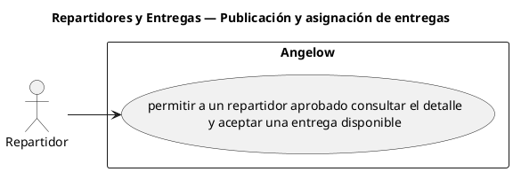

# Repartidores y Entregas — Publicación y asignación de entregas

> 1 casos de uso y 1 requerimientos internos relacionados del subproceso.

## Casos cubiertos

- El sistema debe permitir a un repartidor aprobado consultar el detalle y aceptar una entrega disponible.

## Requerimientos internos relacionados

- El sistema debe publicar una entrega cuando el pago de la orden sea aprobado y el método no sea punto de recogida.
  - Tipo: automatismo interno.
  - Disparador: se aprueba el pago de una orden cuyo método no es punto de recogida.
  - Actor directo: no aplica.
  - Representación: comportamiento posterior al pago; no se fuerza <<include>> porque la aprobación puede provenir de más de un flujo.

## Referencias

- [Índice de diagramas](../README.md)
- [Matriz de requerimientos funcionales](../../matriz-requerimientos-funcionales-actualizada.md)
- [Especificación de casos de uso](../../casos-uso-angelow.md)
