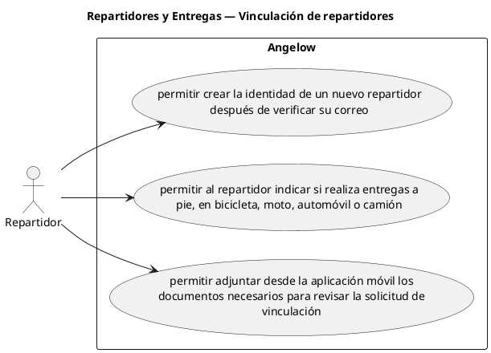

# Repartidores y Entregas — Vinculación de repartidores

> 3 casos de uso del subproceso.

## Casos cubiertos

- El sistema debe permitir crear la identidad de un nuevo repartidor después de verificar su correo.
- El sistema debe permitir al repartidor indicar si realiza entregas a pie, en bicicleta, moto, automóvil o camión.
- El sistema debe permitir adjuntar desde la aplicación móvil los documentos necesarios para revisar la solicitud de vinculación.

## Referencias

- [Índice de diagramas](../README.md)
- [Matriz de requerimientos funcionales](../../matriz-requerimientos-funcionales-actualizada.md)
- [Especificación de casos de uso](../../casos-uso-angelow.md)
