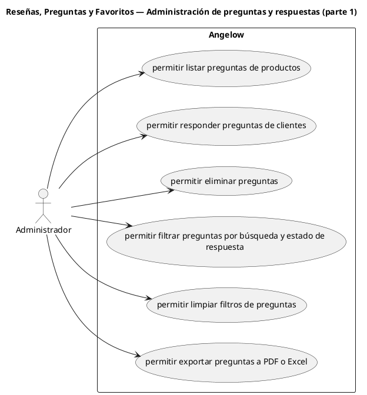

# Reseñas, Preguntas y Favoritos — Administración de preguntas y respuestas (parte 1)

> 6 casos de uso del subproceso.

## Casos cubiertos

- El sistema debe permitir listar preguntas de productos.
- El sistema debe permitir responder preguntas de clientes.
- El sistema debe permitir eliminar preguntas.
- El sistema debe permitir filtrar preguntas por búsqueda y estado de respuesta.
- El sistema debe permitir limpiar filtros de preguntas.
- El sistema debe permitir exportar preguntas a PDF o Excel.

## Referencias

- [Índice de diagramas](../README.md)
- [Matriz de requerimientos funcionales](../../matriz-requerimientos-funcionales-actualizada.md)
- [Especificación de casos de uso](../../casos-uso-angelow.md)
