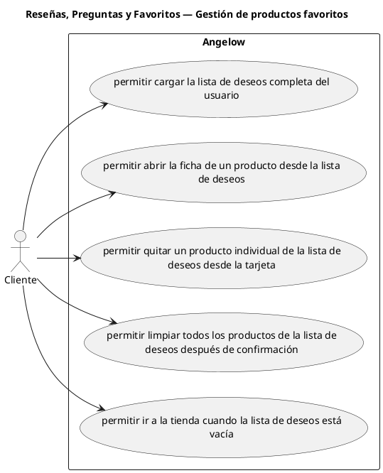

# Reseñas, Preguntas y Favoritos — Gestión de productos favoritos

> 5 casos de uso del subproceso.

## Casos cubiertos

- El sistema debe permitir cargar la lista de deseos completa del usuario.
- El sistema debe permitir abrir la ficha de un producto desde la lista de deseos.
- El sistema debe permitir quitar un producto individual de la lista de deseos desde la tarjeta.
- El sistema debe permitir limpiar todos los productos de la lista de deseos después de confirmación.
- El sistema debe permitir ir a la tienda cuando la lista de deseos está vacía.

## Referencias

- [Índice de diagramas](../README.md)
- [Matriz de requerimientos funcionales](../../matriz-requerimientos-funcionales-actualizada.md)
- [Especificación de casos de uso](../../casos-uso-angelow.md)
