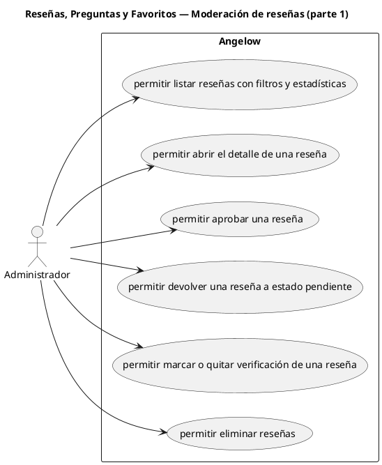

# Reseñas, Preguntas y Favoritos — Moderación de reseñas (parte 1)

> 6 casos de uso del subproceso.

## Casos cubiertos

- El sistema debe permitir listar reseñas con filtros y estadísticas.
- El sistema debe permitir abrir el detalle de una reseña.
- El sistema debe permitir aprobar una reseña.
- El sistema debe permitir devolver una reseña a estado pendiente.
- El sistema debe permitir marcar o quitar verificación de una reseña.
- El sistema debe permitir eliminar reseñas.

## Referencias

- [Índice de diagramas](../README.md)
- [Matriz de requerimientos funcionales](../../matriz-requerimientos-funcionales-actualizada.md)
- [Especificación de casos de uso](../../casos-uso-angelow.md)
