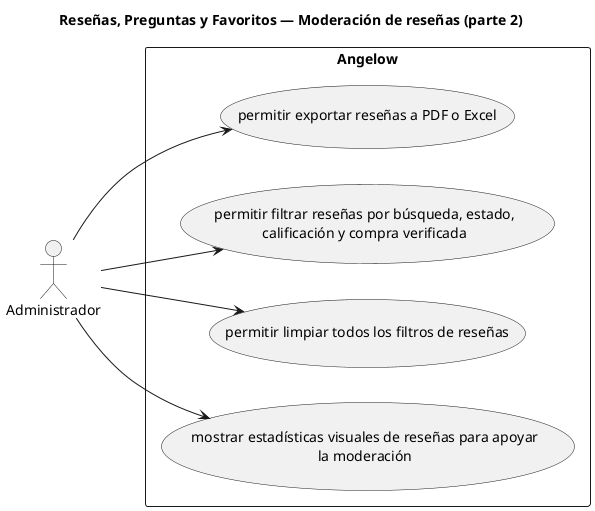

# Reseñas, Preguntas y Favoritos — Moderación de reseñas (parte 2)

> 4 casos de uso del subproceso.

## Casos cubiertos

- El sistema debe permitir exportar reseñas a PDF o Excel.
- El sistema debe permitir filtrar reseñas por búsqueda, estado, calificación y compra verificada.
- El sistema debe permitir limpiar todos los filtros de reseñas.
- El sistema debe mostrar estadísticas visuales de reseñas para apoyar la moderación.

## Referencias

- [Índice de diagramas](../README.md)
- [Matriz de requerimientos funcionales](../../matriz-requerimientos-funcionales-actualizada.md)
- [Especificación de casos de uso](../../casos-uso-angelow.md)
