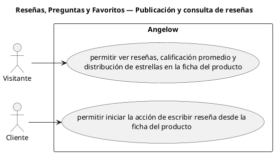

# Reseñas, Preguntas y Favoritos — Publicación y consulta de reseñas

> 2 casos de uso del subproceso.

## Casos cubiertos

- El sistema debe permitir ver reseñas, calificación promedio y distribución de estrellas en la ficha del producto.
- El sistema debe permitir iniciar la acción de escribir reseña desde la ficha del producto.

## Referencias

- [Índice de diagramas](../README.md)
- [Matriz de requerimientos funcionales](../../matriz-requerimientos-funcionales-actualizada.md)
- [Especificación de casos de uso](../../casos-uso-angelow.md)
