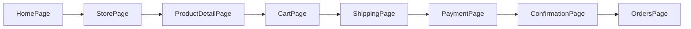

# Flujo de frontend

## Patrones aplicados

- `Modular by feature`: cada dominio vive en `src/modules/<dominio>`.
- `Service layer`: consumo API centralizado en `src/services/*Api.js`.
- `Composables`: sesion compartida en `src/composables/useSession.js`.
- `Presentational components`: componentes reutilizables en `modules/*/components`.
