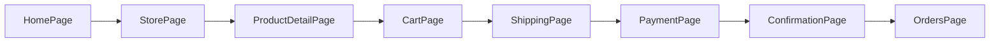

# Flujo de frontend

<!-- indice:auto:start -->
## Índice rápido

- [Documentos relacionados](#documentos-relacionados)
- [Patrones aplicados](#patrones-aplicados)
- [Registro obligatorio de patrones](#registro-obligatorio-de-patrones)
<!-- indice:auto:end -->

Guía de navegación funcional y de patrones específicos del frontend SPA.

## Documentos relacionados

- `../README.md`
- `./exportaciones-admin-reutilizables.md`
- `../../docs/operaciones/manual-tecnico.md`
- `../../docs/patrones/README.md`

```mermaid
flowchart LR
  HOME["HomePage"] --> STORE["StorePage"]
  STORE --> DETAIL["ProductDetailPage"]
  DETAIL --> CART["CartPage"]
  CART --> SHIP["ShippingPage"]
  SHIP --> PAY["PaymentPage"]
  PAY --> CONF["ConfirmationPage"]
  CONF --> ORDERS["OrdersPage"]
```

## Patrones aplicados

- `Modular by feature`: cada dominio vive en `src/modules/<dominio>`.
- `Service layer`: consumo API centralizado en `src/services/*Api.js`.
- `Composables`: sesión compartida en `src/composables/useSession.js`.
- `Presentational components`: componentes reutilizables en `modules/*/components`.
- `Facade + Strategy para exportaciones admin`: `AdminExportActions` y `useAdminDataExport` centralizan botones, branding y generación PDF/Excel.

## Registro obligatorio de patrones

- Cada cambio nuevo debe documentar patrón(es) del catálogo Refactoring Guru usados o justificar por qué no aplica.
- El registro vigente se mantiene en `docs/patrones/README.md`.
