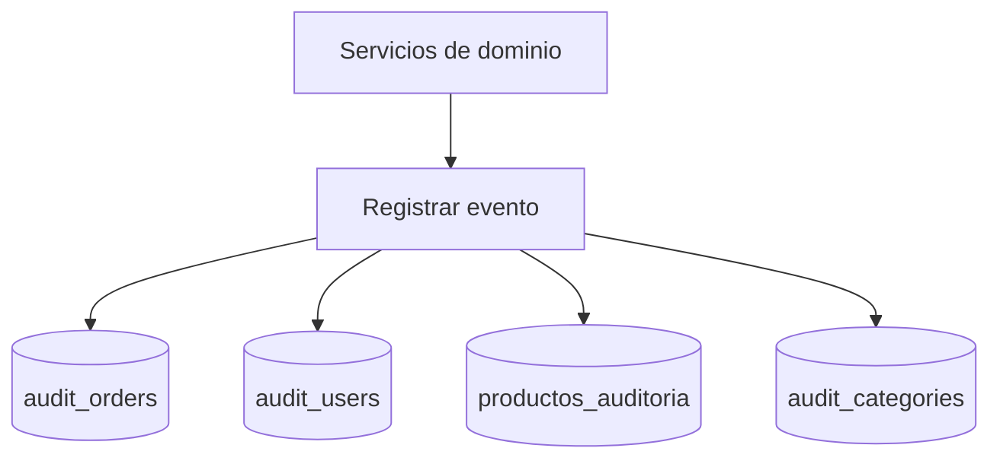

# Flujo de audit-service

```mermaid
flowchart TD
  A[Servicios de dominio] --> B[Registrar evento]
  B --> C[(audit_orders)]
  B --> D[(audit_users)]
  B --> E[(productos_auditoria)]
  B --> F[(audit_categories)]
```

## Patrones usados

- Registro append-only para trazabilidad.
- Separación por tipo de auditoría para consultas eficientes.
