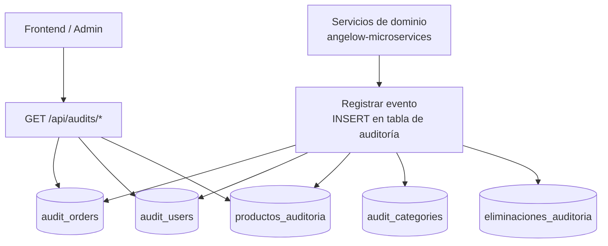

# Flujo de audit-service

<!-- indice:auto:start -->
## Índice rápido

- [Diagrama de flujo](#diagrama-de-flujo)
- [Patrones usados](#patrones-usados)
- [Estructura de archivos](#estructura-de-archivos)
- [Documentación relacionada](#documentación-relacionada)
<!-- indice:auto:end -->

## Diagrama de flujo



## Patrones usados

| Patrón               | Archivo(s) donde se aplica                          | Problema que resuelve                                   |
|----------------------|------------------------------------------------------|----------------------------------------------------------|
| **Registro append-only** | `AuditController.php`, migración `0001_01_01_000000_create_users_table.php` | Garantiza trazabilidad inmutable: una vez insertado, un registro de auditoría nunca se modifica ni elimina. |
| **Separación por tipo de auditoría** | Migración `0001_01_01_000000_create_users_table.php` (5 tablas) | Cada dominio (órdenes, usuarios, productos, categorías, eliminaciones) tiene su propia tabla, evitando acoplamiento y permitiendo consultas eficientes sin joins masivos. |
| **Controlador único** | `AuditController.php` | Centraliza la lógica de exposición de datos de auditoría en un solo controlador con métodos específicos por dominio. |
| **Health check** | `HealthController.php`, ruta `/api/health` | Permite a Docker Compose y orquestadores verificar que el servicio responde antes de enrutar tráfico. |
| **Fachada DB (Query Builder)** | `AuditController.php` (métodos `orders()`, `users()`, `products()`) | Acceso directo a tablas sin modelo Eloquent, adecuado para tablas append-only donde no se necesita lógica de negocio del lado del modelo. |

## Estructura de archivos

```
services/audit-service/
├── app/
│   ├── Http/Controllers/
│   │   ├── AuditController.php    # Endpoints de consulta de auditoría
│   │   ├── Controller.php         # Controlador base abstracto
│   │   └── HealthController.php   # Health check del servicio
│   └── Models/
│       └── User.php               # Modelo de usuario (compatibilidad auth)
├── bootstrap/
│   ├── app.php                    # Bootstrap de Laravel
│   └── providers.php              # Registro de service providers
├── config/                        # Configuración del servicio
├── database/
│   ├── factories/UserFactory.php  # Fábrica de usuarios para tests
│   ├── migrations/
│   │   └── 0001_01_01_000000_create_users_table.php  # Migración principal
│   └── seeders/DatabaseSeeder.php # Sembrador de datos de prueba
├── docs/
│   └── README.md                  # Esta documentación
├── routes/
│   ├── api.php                    # Rutas de API
│   ├── web.php                    # Ruta de bienvenida
│   └── console.php                # Comandos Artisan
├── tests/                         # Pruebas unitarias y de integración
├── Dockerfile                     # Imagen Docker del servicio
├── README.md                      # Documentación principal del servicio
└── .env                           # Variables de entorno
```

## Documentación relacionada

- [README principal del servicio](../README.md)
- [Manual técnico del repositorio](../../docs/operaciones/manual-tecnico.md)
