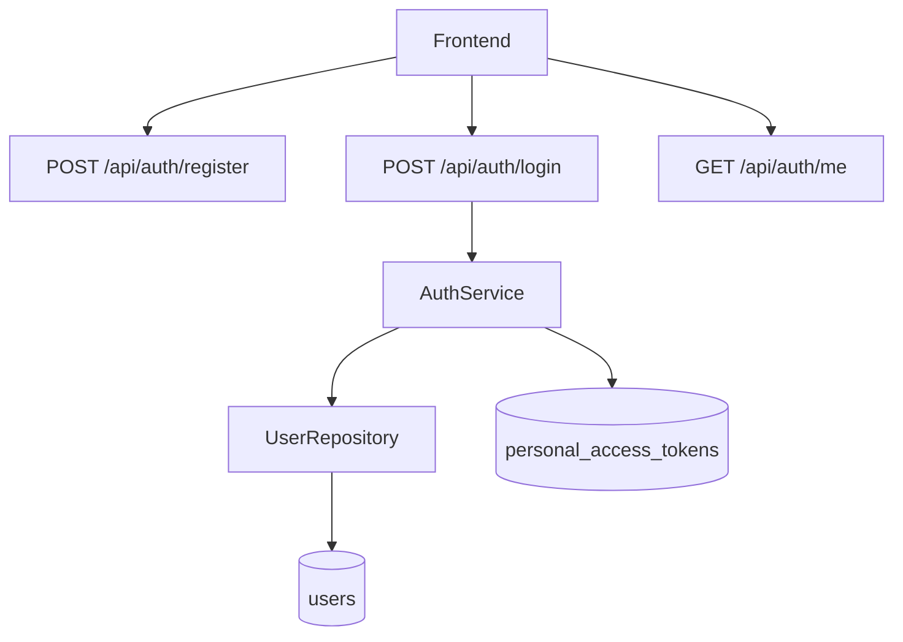

# Flujo de auth-service

## Patrones de diseño

- `Repository Pattern`: acceso a datos desacoplado.
- `Service Layer`: reglas de negocio de autenticación.
- `DTO + Request Validation`: entrada controlada.
- `Token-based auth`: Sanctum para sesiones API.
