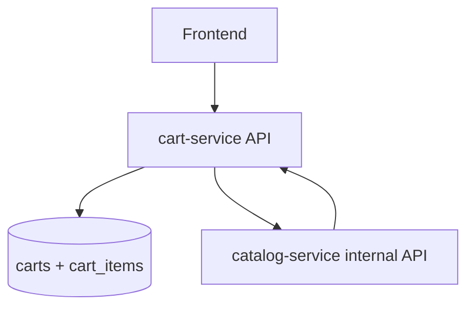

# Flujo de cart-service

## Patrones de diseno

- `Service Layer`: `App\Services\CartService`.
- `Repository Pattern`: `App\Repositories\QueryBuilderCartRepository`.
- `API Composition`: el carrito enriquece datos con `catalog-service`.
- `Database per service`: solo persiste tablas de carrito.
