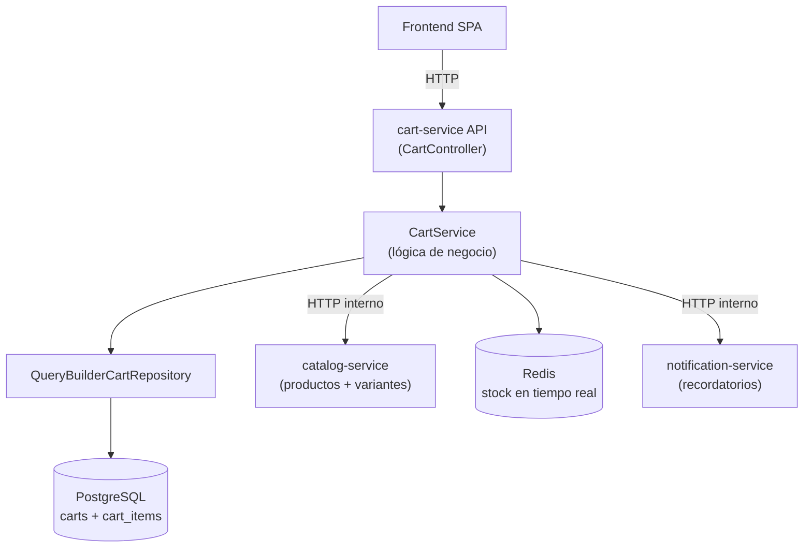

# Flujo del cart-service

<!-- indice:auto:start -->
## Índice rápido

- [Arquitectura](#arquitectura)
- [Patrones de diseño](#patrones-de-diseno)
- [Estructura de archivos](#estructura-de-archivos)
<!-- indice:auto:end -->

## Arquitectura


```mermaid
flowchart TD
  FE["Frontend SPA"] -->|HTTP| API["cart-service API<br/>(CartController)"]
  API --> SVC["CartService<br/>(lógica de negocio)"]
  SVC --> REPO["QueryBuilderCartRepository"]
  REPO --> DB[("PostgreSQL<br/>carts + cart_items")]

  SVC -->|HTTP interno| CAT["catalog-service<br/>(productos + variantes)"]
  SVC --> REDIS[("Redis<br/>stock en tiempo real")]
  SVC -->|HTTP interno| NOTIF["notification-service<br/>(recordatorios)"]
```

## Patrones de diseño

| Patrón | Archivo | Problema que resuelve |
|--------|---------|----------------------|
| **Service Layer** | `app/Services/CartService.php` | Centraliza la lógica de negocio del carrito separándola de los controladores y la persistencia |
| **Repository Pattern** | `app/Repositories/QueryBuilderCartRepository.php` | Abstrae el acceso a datos (DB facade) detrás de una interfaz, permitiendo cambiar la implementación sin afectar al servicio |
| **Repository Interface** | `app/Repositories/Contracts/CartRepositoryInterface.php` | Define el contrato que cualquier implementación de repositorio debe cumplir (desacoplamiento) |
| **API Composition** | `app/Services/CartService.php:310-330` | El carrito enriquece sus ítems consultando datos de productos y variantes desde catalog-service bajo demanda |
| **Database per Service** | `database/migrations/0001_01_01_000000_create_users_table.php` | Cada microservicio tiene su propia base de datos; el cart-service solo persiste tablas de carrito |
| **Failover (Redis)** | `app/Services/CartService.php:367-388` | Si Redis no está disponible, usa el stock de catálogo como fallback en lugar de fallar |
| **Rate Limiter (Redis)** | `app/Services/CartService.php:238-294` | Evita enviar recordatorios duplicados a un mismo usuario dentro de una ventana de 6 horas |

## Estructura de archivos

```
cart-service/
├── app/
│   ├── Http/Controllers/
│   │   ├── CartController.php      # Controlador REST del carrito
│   │   ├── Controller.php          # Controlador base
│   │   └── HealthController.php    # Endpoint de salud
│   ├── Models/
│   │   └── User.php                # Modelo de usuario (compartido)
│   ├── Providers/
│   │   ├── AppServiceProvider.php  # Proveedor principal
│   │   └── RepositoryServiceProvider.php  # Bindings de repositorios
│   ├── Repositories/
│   │   ├── Contracts/
│   │   │   └── CartRepositoryInterface.php  # Contrato del repositorio
│   │   └── QueryBuilderCartRepository.php   # Implementación con DB facade
│   └── Services/
│       └── CartService.php         # Lógica de negocio del carrito
├── config/                         # Configuración de Laravel (12 archivos)
├── database/migrations/            # Migraciones: carts, cart_items, cache, jobs
├── routes/
│   ├── api.php                     # Rutas de la API REST
│   ├── console.php                 # Comandos Artisan
│   └── web.php                     # Ruta de bienvenida
├── tests/
│   ├── Feature/
│   │   ├── CartApiTest.php         # Pruebas de integración del carrito
│   │   └── ExampleTest.php         # Prueba de ejemplo (health)
│   ├── Unit/
│   │   └── ExampleTest.php         # Prueba unitaria básica
│   └── TestCase.php                # Clase base de pruebas
├── Dockerfile                      # Build de la imagen Docker
├── README.md                       # Documentación principal
└── docs/README.md                  # Documentación técnica (este archivo)
```
