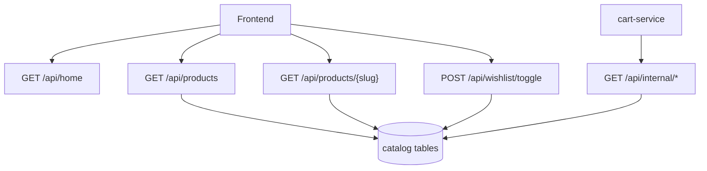

# Flujo de catalog-service

## Patrones de diseno

- `Repository + Service`: controladores delgados y reglas concentradas.
- `API composition`: `/api/home` agrega contenido transversal.
- `Internal API`: contratos ligeros para comunicacion entre servicios.
