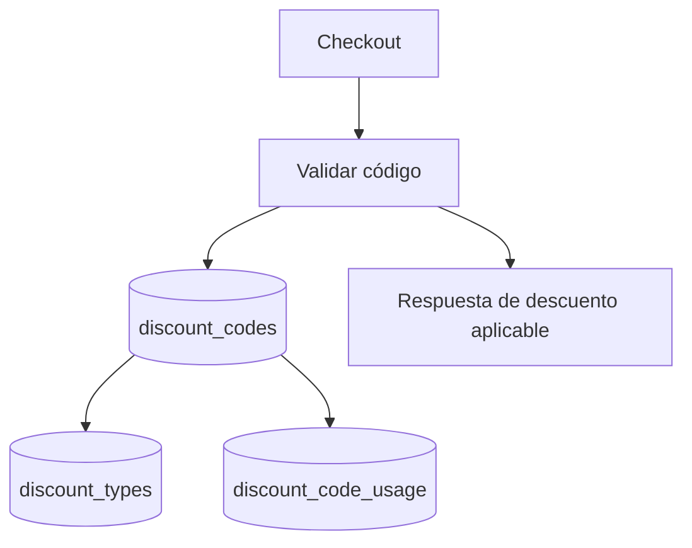

# Flujo de discount-service

```mermaid
flowchart TD
  A[Checkout] --> B[Validar código]
  B --> C[(discount_codes)]
  C --> D[(discount_types)]
  C --> E[(discount_code_usage)]
  B --> F[Respuesta de descuento aplicable]
```

## Patrones usados

- Validación de reglas por servicio.
- Persistencia versionada con migraciones.
- Tabla de uso para evitar duplicidades de cupones.
