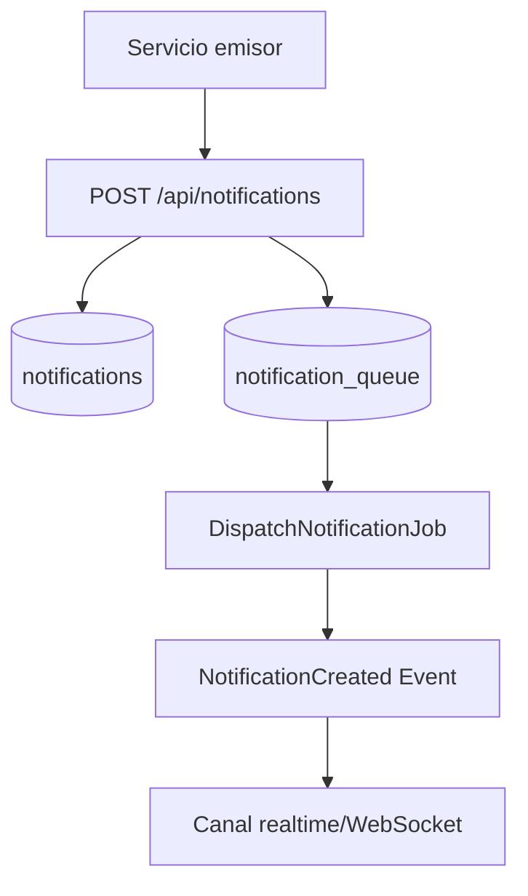

# Flujo de notification-service

## Patrones usados

- Outbox/queue table para despacho asíncrono.
- Job único (`ShouldBeUnique`) contra duplicidad.
- Evento de dominio para notificación en tiempo real.
