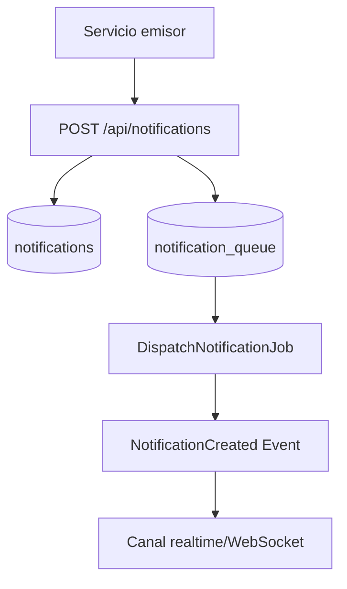

# Flujo de notification-service

<!-- indice:auto:start -->
## Índice rápido

- [Patrones usados](#patrones-usados)
<!-- indice:auto:end -->

```mermaid
flowchart TD
  A[Servicio emisor] --> B[POST /api/notifications]
  B --> C[(notifications)]
  B --> D[(notification_queue)]
  D --> E[DispatchNotificationJob]
  E --> F[NotificationCreated Event]
  F --> G[Canal realtime/WebSocket]
```

## Patrones usados

- Outbox/queue table para despacho asíncrono.
- Job único (`ShouldBeUnique`) contra duplicidad.
- Evento de dominio para notificación en tiempo real.
