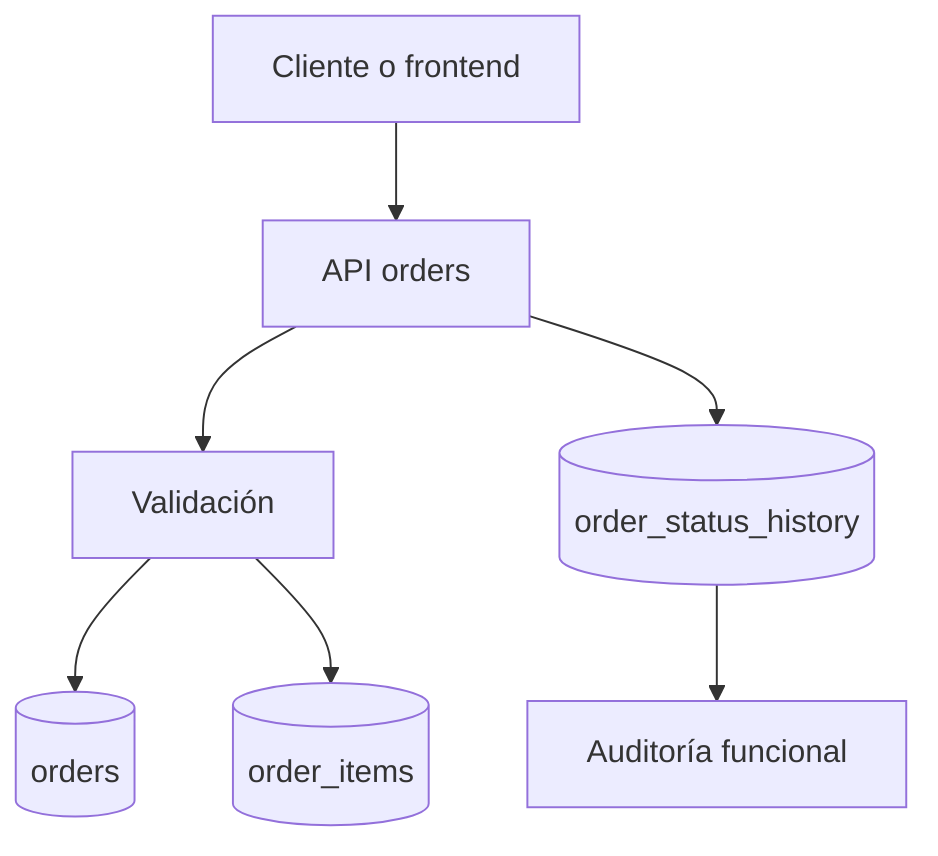

# Flujo de order-service

## Diseño

- Arquitectura por capas Laravel.
- Persistencia en PostgreSQL con migraciones versionadas.
- Preparado para consumir eventos de pago/envío y publicar cambios de estado.
