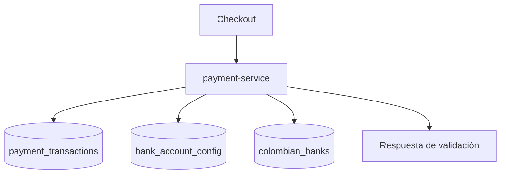

# Flujo de payment-service

```mermaid
flowchart TD
  A[Checkout] --> B[payment-service]
  B --> C[(payment_transactions)]
  B --> D[(bank_account_config)]
  B --> E[(colombian_banks)]
  B --> F[Respuesta de validación]
```

## Patrones usados

- API REST con validación declarativa.
- Persistencia con migraciones PostgreSQL.
- Flujo de verificación desacoplado por estado.
