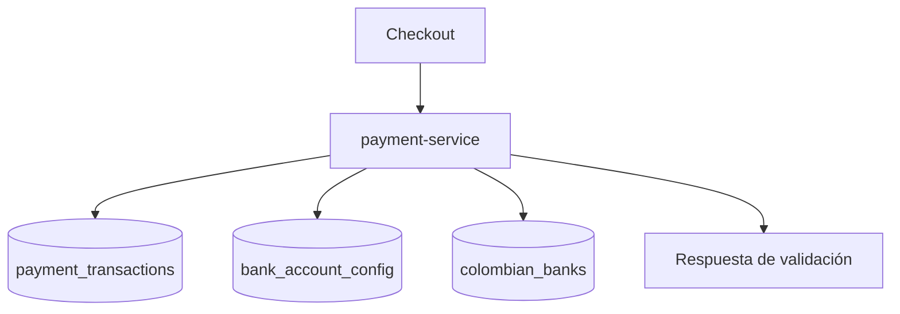

# Flujo de payment-service

<!-- indice:auto:start -->
## Índice rápido

- [Patrones usados](#patrones-usados)
<!-- indice:auto:end -->

## Patrones usados

- API REST con validación declarativa.
- Persistencia con migraciones PostgreSQL.
- Flujo de verificación desacoplado por estado.
