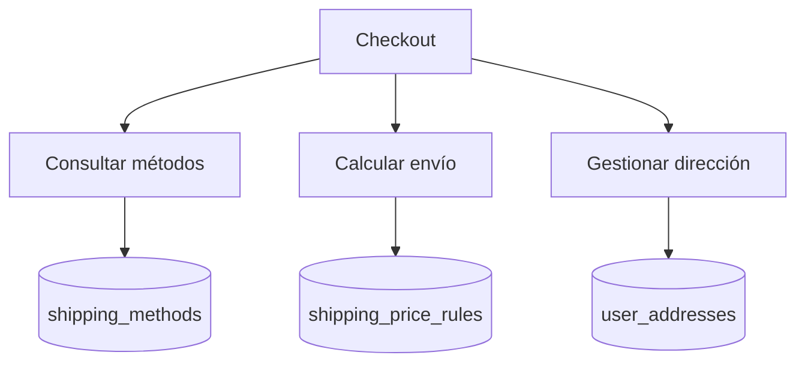

# Flujo de shipping-service

```mermaid
flowchart TD
  A[Checkout] --> B[Consultar métodos]
  B --> C[(shipping_methods)]
  A --> D[Calcular envío]
  D --> E[(shipping_price_rules)]
  A --> F[Gestionar dirección]
  F --> G[(user_addresses)]
```

## Patrones usados

- API REST de consulta y cálculo.
- Reglas desacopladas por tabla para costos variables.
- Persistencia de dirección separada del pedido.
