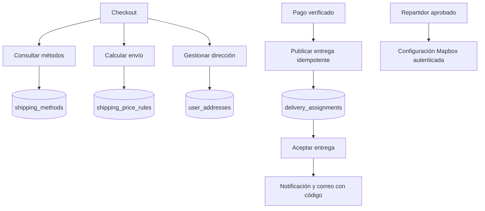

# Flujo de shipping-service

<!-- indice:auto:start -->
## Índice rápido

- [Patrones usados](#patrones-usados)
<!-- indice:auto:end -->

## Patrones usados

- API REST de consulta y cálculo.
- Reglas desacopladas por tabla para costos variables.
- Persistencia de dirección separada del pedido.
- La publicación interna conserva el nombre y tiempo estimado del método; puede usar esa instantánea cuando el identificador distribuido no esté disponible.
- `GET /api/courier/map-config` entrega la configuración pública de Mapbox sin caché y exige una sesión de repartidor aprobada y activa.
- Al aceptar una entrega se solicita a `notification-service` el aviso en bandeja y el correo del código mediante su plantilla global. Una falla del canal no revierte la asignación y queda registrada para operación.
