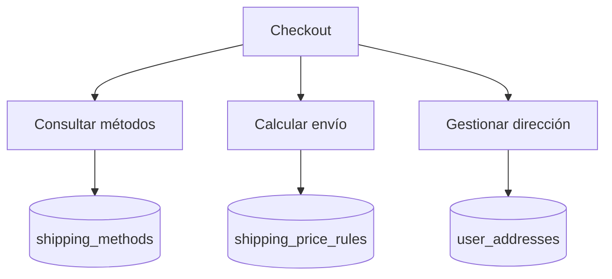

# Flujo de shipping-service

<!-- indice:auto:start -->
## Índice rápido

- [Patrones usados](#patrones-usados)
<!-- indice:auto:end -->

## Patrones usados

- API REST de consulta y cálculo.
- Reglas desacopladas por tabla para costos variables.
- Persistencia de dirección separada del pedido.
